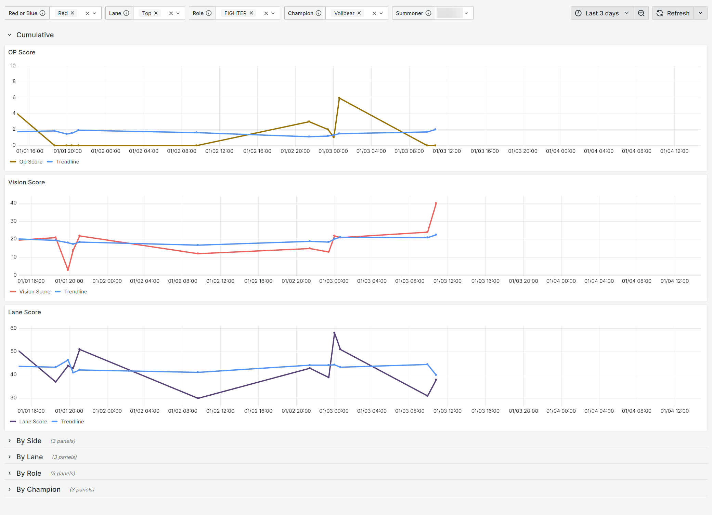
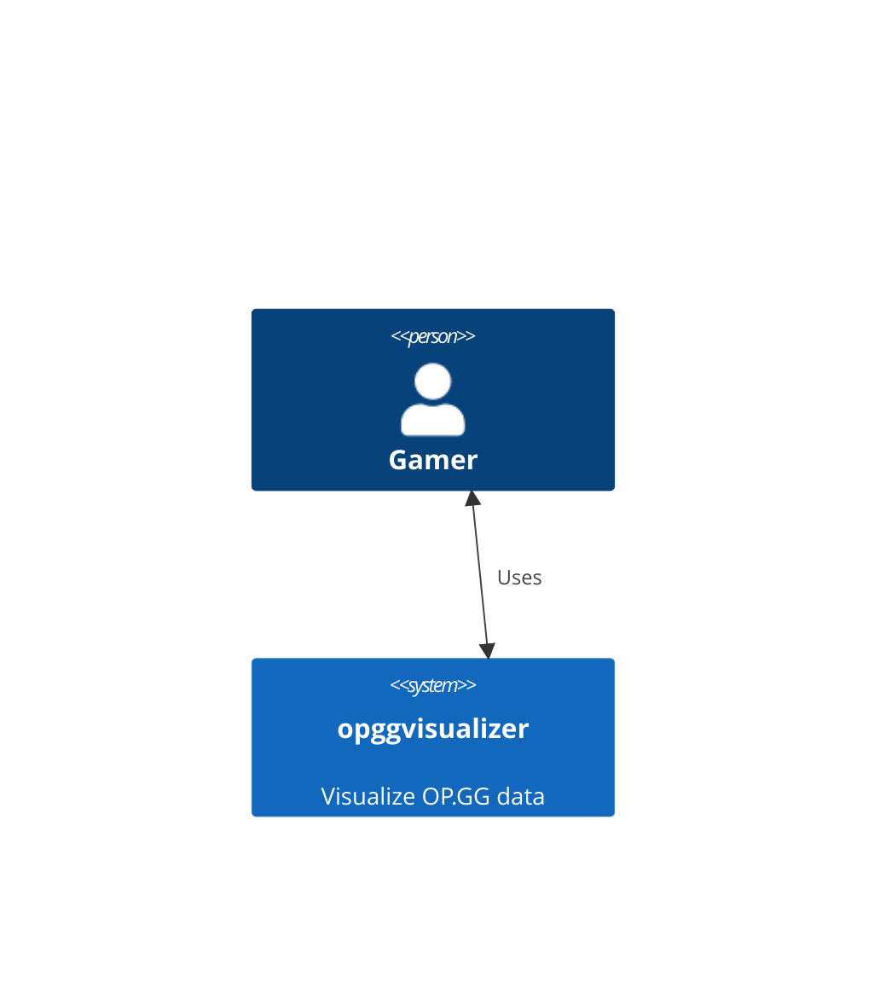
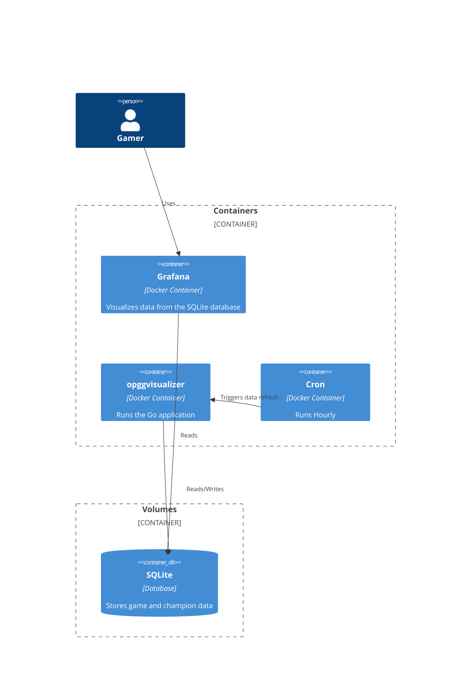
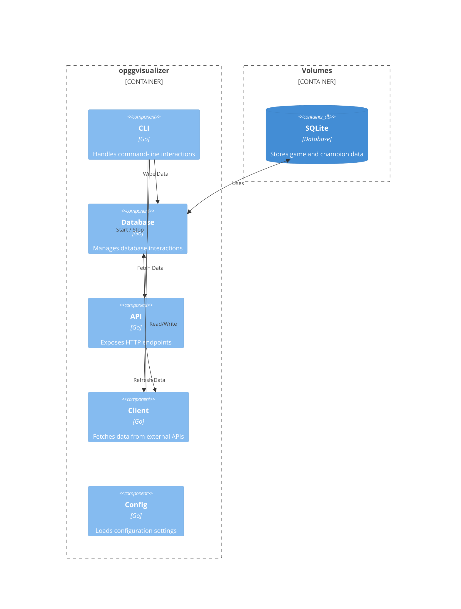
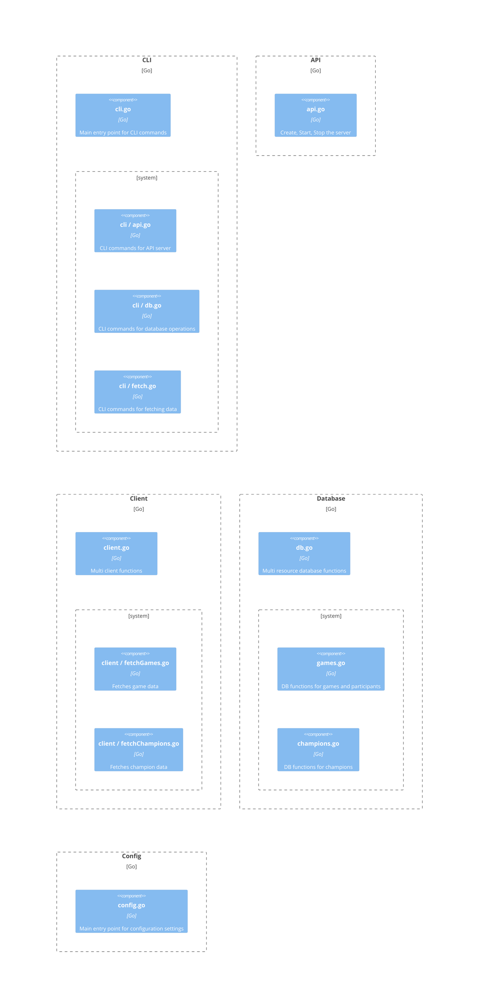

# opggvisualizer

[op.gg](https://op.gg) is an invaluable resource for League of Legends players. Building on that, opggvisualizer enables players to visualize their op.gg statistics over a longer time, and at a more granular level. It uses a sqlite database, a grafana dashboard, a Go backend, and a cron triggered daily update.

This project would not be possible without

- [op.gg](https://op.gg)
- [ddragon](https://riot-api-libraries.readthedocs.io/en/latest/ddragon.html)

This application makes a single api call to both services every 24 hours. Please do not abuse their services by increasing that threshhold without additional caching.

### Screenshot


*...I will not be accepting feedback on these stats*

### System Requirements

- Docker
- docker-compose
- Go
- Make (optional, but recommended)

### Environment Variables

Several environment variables are required. Create a `.env` file in the root directory with the following contents.

```
SUMMONER_ID=<<SUMMONER_ID>>
DATABASE_PATH=/opggvisualizer_data/data.db
GF_SECURITY_ADMIN_PASSWORD=admin
```

Replace `<<SUMMONER_ID>>` with the summoner id obtained from the op.gg http call.

Replace the admin password with a more secure password if desired. Otherwise you will be prompted to change it on initial login.

### Running the app

Build: `make build`

Initialize Data `make init`

Run: `make run`

### Grafana

The Grafana dashboard can be accessed at http://localhost:3000

The initial credentials are

- Username: `admin`
- Password: `admin`

### Refresh Cycle

By default the application will trigger an update every hour. This is set by the cron timing in `./docker-compose.yml`. This **may** trigger a data pull.

By default the application will pull fresh data once every 24 hours. When triggered, the current time is checked against a timestamp in the `fetch` database table. These timestamps are saved independently for Games and Champions. The timestamp is updated on successful fetches.

## C4 Diagrams

### Context Diagram



### Container Diagram



### Component Diagram



### Code Diagram


